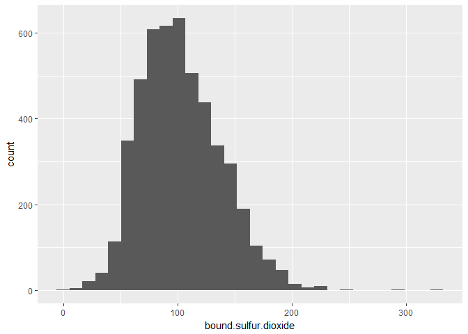
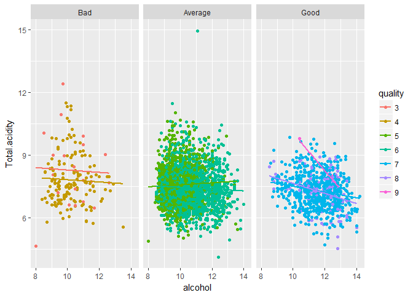

Examining Chemicals Properties of White Wine
========================================================

Author: Tanbir <br>
Completion Date: December 2017<br>
<br>
Version: 0.9 (It's actually considered 1.0 but there are some tweeks/additions I want to do)<br>
Future Updates: Table of contents and additional data will be added soon.<br>
Features: R language


# Introduction 

This is a exploration of chemcial properties of White Wine, I will be exploring the properties that influence quality of White Wine. Also, I'll be using R to examine values within the data to determine relationships between each other. Lets start of with some preliminary exploration of the dataset and examine a summary of the data.

# Univariate Plots Section

First, let us examine the variables and statistical summary of White Wine


```
## [1] 13
```

```
##  [1] "X"                    "fixed.acidity"        "volatile.acidity"    
##  [4] "citric.acid"          "residual.sugar"       "chlorides"           
##  [7] "free.sulfur.dioxide"  "total.sulfur.dioxide" "density"             
## [10] "pH"                   "sulphates"            "alcohol"             
## [13] "quality"
```

```
## 'data.frame':	4898 obs. of  13 variables:
##  $ X                   : int  1 2 3 4 5 6 7 8 9 10 ...
##  $ fixed.acidity       : num  7 6.3 8.1 7.2 7.2 8.1 6.2 7 6.3 8.1 ...
##  $ volatile.acidity    : num  0.27 0.3 0.28 0.23 0.23 0.28 0.32 0.27 0.3 0.22 ...
##  $ citric.acid         : num  0.36 0.34 0.4 0.32 0.32 0.4 0.16 0.36 0.34 0.43 ...
##  $ residual.sugar      : num  20.7 1.6 6.9 8.5 8.5 6.9 7 20.7 1.6 1.5 ...
##  $ chlorides           : num  0.045 0.049 0.05 0.058 0.058 0.05 0.045 0.045 0.049 0.044 ...
##  $ free.sulfur.dioxide : num  45 14 30 47 47 30 30 45 14 28 ...
##  $ total.sulfur.dioxide: num  170 132 97 186 186 97 136 170 132 129 ...
##  $ density             : num  1.001 0.994 0.995 0.996 0.996 ...
##  $ pH                  : num  3 3.3 3.26 3.19 3.19 3.26 3.18 3 3.3 3.22 ...
##  $ sulphates           : num  0.45 0.49 0.44 0.4 0.4 0.44 0.47 0.45 0.49 0.45 ...
##  $ alcohol             : num  8.8 9.5 10.1 9.9 9.9 10.1 9.6 8.8 9.5 11 ...
##  $ quality             : int  6 6 6 6 6 6 6 6 6 6 ...
```

```
##        X        fixed.acidity    volatile.acidity  citric.acid    
##  Min.   :   1   Min.   : 3.800   Min.   :0.0800   Min.   :0.0000  
##  1st Qu.:1225   1st Qu.: 6.300   1st Qu.:0.2100   1st Qu.:0.2700  
##  Median :2450   Median : 6.800   Median :0.2600   Median :0.3200  
##  Mean   :2450   Mean   : 6.855   Mean   :0.2782   Mean   :0.3342  
##  3rd Qu.:3674   3rd Qu.: 7.300   3rd Qu.:0.3200   3rd Qu.:0.3900  
##  Max.   :4898   Max.   :14.200   Max.   :1.1000   Max.   :1.6600  
##  residual.sugar     chlorides       free.sulfur.dioxide
##  Min.   : 0.600   Min.   :0.00900   Min.   :  2.00     
##  1st Qu.: 1.700   1st Qu.:0.03600   1st Qu.: 23.00     
##  Median : 5.200   Median :0.04300   Median : 34.00     
##  Mean   : 6.391   Mean   :0.04577   Mean   : 35.31     
##  3rd Qu.: 9.900   3rd Qu.:0.05000   3rd Qu.: 46.00     
##  Max.   :65.800   Max.   :0.34600   Max.   :289.00     
##  total.sulfur.dioxide    density             pH          sulphates     
##  Min.   :  9.0        Min.   :0.9871   Min.   :2.720   Min.   :0.2200  
##  1st Qu.:108.0        1st Qu.:0.9917   1st Qu.:3.090   1st Qu.:0.4100  
##  Median :134.0        Median :0.9937   Median :3.180   Median :0.4700  
##  Mean   :138.4        Mean   :0.9940   Mean   :3.188   Mean   :0.4898  
##  3rd Qu.:167.0        3rd Qu.:0.9961   3rd Qu.:3.280   3rd Qu.:0.5500  
##  Max.   :440.0        Max.   :1.0390   Max.   :3.820   Max.   :1.0800  
##     alcohol         quality     
##  Min.   : 8.00   Min.   :3.000  
##  1st Qu.: 9.50   1st Qu.:5.000  
##  Median :10.40   Median :6.000  
##  Mean   :10.51   Mean   :5.878  
##  3rd Qu.:11.40   3rd Qu.:6.000  
##  Max.   :14.20   Max.   :9.000
```

From here we can see there are several values in numeric and two in int. Lets make a quick histogram for all the variables to see how they are generally distributed.

<!-- -->

It seems like most of the qualities in the White Wine is normally distributed. There are several variable that came out as oddly distrubted such as having a long tail in residual sugar. Lets examine sugar, chloride, acidity and density a bit closer because we want to determine the exact distribution for them.

<!-- -->

```
##    Min. 1st Qu.  Median    Mean 3rd Qu.    Max. 
##   3.800   6.300   6.800   6.855   7.300  14.200
```

Fixed acidity has a normal distribution after removing outliers.

<!-- -->

```
##     Min.  1st Qu.   Median     Mean  3rd Qu.     Max. 
## -1.09691 -0.67778 -0.58503 -0.58090 -0.49485  0.04139
```

The log10 tranformation makes the volatile acidity distribution look more 
normal.

<!-- -->

```
##    Min. 1st Qu.  Median    Mean 3rd Qu.    Max. 
##   0.600   1.700   5.200   6.391   9.900  65.800
```

The residual sugar seems to have long right tail after adjusting the quantile that is displayed.

<!-- -->

```
##    Min. 1st Qu.  Median    Mean 3rd Qu.    Max. 
## 0.00900 0.03600 0.04300 0.04577 0.05000 0.34600
```

Chlorides shows a normal distribution after adjusting the quantile as well.

<!-- -->

Density has a normal distribution after removing the outter right outlier.

We can see that residual sugar and chloride have outliers. However residual 
sugar tends to have long tail unlike chloride which has a normal distribution without it's outlier. Since our primary focus is quality,
let us continue on examining the data for it.

<!-- -->

```
## 
##    3    4    5    6    7    8    9 
##   20  163 1457 2198  880  175    5
```

```
##    Min. 1st Qu.  Median    Mean 3rd Qu.    Max. 
##   3.000   5.000   6.000   5.878   6.000   9.000
```

There is a large amount of 5 and 6 values in quality.

## Univariate Analysis

### What is the structure of your dataset?

* The structure of the data includes 4898 observation of 13 variables. The X variable seems to increment by one and counts the amount of time the wine was rated in quality. Both have the same length in the data.
* Quality is rated based on 0 to 10 as mentioned in the documentation.
* About 45% of the Wine has a quality of 6.
* The median quality for White Wine is 6, max quality is 9 and minimum is 3.

### What is/are the main feature(s) of interest in your dataset?

When examining the variables, our initial goal was to determine which chemical properties influence the quality of White wines. From this dataset the main interest is the variable named quality. In the description text file, it states that the rating for quality is 0 to 10, meaning the numbers are suppose to be categorical. We already seen the histogram which seems to show a normal distribution, bell curve.

### What other features in the dataset do you think will help support your \
investigation into your feature(s) of interest?

It's not only the quality variable of the data set that shows of interest but when you examine the histogram for volatile acidity, fixed acity, free sulfur dioxide, total sulfur dioxide and pH level, you will notice that they have a normal distribution curve and some of them require to be on a base of logarithimic scale to see it. We can assume from the data that they might be dependant of each other and perhaps contribute to the quality of the wine?

### Did you create any new variables from existing variables in the dataset?

For now this was just examination and exploring the data one unit at a time. But we know that since there is a rating system of 0 through 10 for the wine, we can create a new variable and split them because right now it's numeric and not categorical format. By creating a new variable and splitting them, we will make it into a categorical type of quality which will come in handy for comparison. Then added factoring for quality and assigning the old numeric values into a new variable because of how the box plots was appearing when checking for specific numbers.

<!-- -->

```
## 
##     Bad Average    Good 
##     183    3655    1060
```

You can see large amount of average rating due to 5 and 6 quality being large.

We also, know that total sulfure dioxide consist of free sulfure dioxide and bound sulfure dioxide according to the documentation and bound sulfure dioxide 
is missing from this data set. Lets create one and quick plot for it.

<!-- -->

```
##    Min. 1st Qu.  Median    Mean 3rd Qu.    Max. 
##     4.0    78.0   100.0   103.1   125.0   331.0
```

Lets make a total acid variable as well since the documentation also states that volatile and fix are just two different form and citric acid is 
added for freshness. There is total sulfur dioxide variable and not total acid 
variable which is inconsistent to what the data presents. If assumptions are correct this will be related to pH level according to basic science knowledge. Lets create one quick plot for it also.

<!-- -->

```
##    Min. 1st Qu.  Median    Mean 3rd Qu.    Max. 
##   4.130   6.890   7.405   7.467   7.960  14.960
```


### Of the features you investigated, were there any unusual distributions? \Did you perform any operations on the data to tidy, adjust, or change the form of  the data? If so, why did you do this?

There were few that we found unsual in the distribution. We seen that volatile acidity, sulfur dioxides, sulphates, and alcohol had a long tail but when examined close and adjusted the graph with sugar was the one with a long 
tail. The rest were normal. Also some of the data have outliers such as acid, chloride, and sulfure dioxide so this gives us an idea what to expect when we examine the correlation and plots for it. Also, as mentioned earlier just in the prior question that we created new variables to adjust the data. Now lets start with Bivariate Plots and look at the general lay out of the data to get a better sense how they increase


# Bivariate Plots Section

We need to start off with a general look of the possible pair of graphs by grabbing a sample of each. Since we have a categorical variable based on the quality of wine, we can use that to create our second pairs of graph to have an overview on that as well. The first set of pair graphs will exclude the categorical value. In addition both of sets of pair graph will exclude X 
value because it is just a identifier that counts and increases by 1 as the wine is checked. It has no influence to the rest of the properties. 


```
##  [1] "X"                    "fixed.acidity"        "volatile.acidity"    
##  [4] "citric.acid"          "residual.sugar"       "chlorides"           
##  [7] "free.sulfur.dioxide"  "total.sulfur.dioxide" "density"             
## [10] "pH"                   "sulphates"            "alcohol"             
## [13] "quality"              "Wine_rating"          "quality_numeric"     
## [16] "bound.sulfur.dioxide" "Total.acidity"
```

<!-- -->

We can see an overview that pH level, alcohol and density of White Wine plays a trend in determining the good quality of white Wine. In addition we know from basic science that higher pH value the less acidic it is and most of the good quality of Wine tend to have a higher pH. So let's examine the specific content by comparing it against the wine type.  

<!-- -->

From the box plots we can see that White Wine that has a quality higher than 6 have:

* Less total acidic content but the about the same amount in citric acid 
compared to the average.
* About moderate content in sulfur dioxide. Not to little and not to 
much and has less bound sulfure dioxide.
* Less chloride(salt) and average amount of residual sugar.
* less density.
* A very high amount of alcohol content.

This tells us a lot about what properities that influence the quality of white wine. Earlier in the plot matrix we seen that there was a strong correlation between residual sugar and density. So lets examine it.

<!-- -->

```
## [1] 0.8389665
```

The amount of residual sugar increases the density of the wine. The correlation value presents that as well.

<!-- -->

```
## [1] 0.265331
```

Fixed acidty also increases the density. Lets see if they both have a relationship with each other.

<!-- -->

```
## [1] 0.0890207
```

They do not seem to strongly correlate.


```
##        Fixed acidity     Volatile acidity          Citric acid 
##         -0.113662831         -0.194722969         -0.009209091 
##        Total acidity       Residual Sugar            Chlorides 
##         -0.131377207         -0.097576829         -0.209934411 
##  Free Sulfur dioxide Bound Sulfur dioxide Total Sulfur dioxide 
##          0.008158067         -0.217867760         -0.174737218 
##              Density                   pH            Sulphates 
##         -0.307123313          0.099427246          0.053677877 
##              Alcohol 
##          0.435574715
```

From this we can see that highest correlation of properties that determine the quality of white Wine are Density and Alcohol. There is a possible chance 
Density and Alcohol are related as well. In addition we see that chlorides, acidity and sulfure dioxides tends to show a correlation of negative. However we must remember that for a rule thumb that for the correlation to be strong we 
have to hit at least .3 positive or .3 negative. We can solidly say Alcohol and Density have a correlation since they have hit the mark of .3 and that acidity, chlorides and sulfur have some sort of mini impact on White Wine. For our next step we have to compare Density and Alcohol with each other since they seem to show a solid correlation.

## Bivariate Analysis

### Talk about some of the relationships you observed in this part of the \
investigation. How did the feature(s) of interest vary with other features in \
the dataset?

Alcohol and Density strongly correlates with the quality of white Wine. In addition we know that it tends to have less chloride(salt) and average amount of residual sugar.

### Did you observe any interesting relationships between the other features \
(not the main feature(s) of interest)?

We observe that sulfur dioxide can slightly effect pH level when it's at a level of 3.0 and below.

### What was the strongest relationship you found?

The alcohol content had the strongest correlation here with quality. Density followed next. I can be positive that they both also have a relationship wtih each other and we will find that when we examine them wtih multivariate plots.

# Multivariate Plots Section

In this section I'll explore relationships between alcohol and the secondary factors in more details to see if a pattern emerges since we know their is alcohol has a strong effect for determining good quality wine. 

<!-- -->

You can see as alochol content for all, increases as density decreases. 

<!-- -->

Over here  chlorides tend to be low at the highest quality of wine and decreases as alochol content increases.

<!-- -->

Total acidity shows less change for bad and average quality but for good quality type of wine it tends to decrease as alcohol content increases.

<!-- -->

Bound sulfur decreases for all the quality type as alcohol content increases.

<!-- -->

Total Sulfur slightly decreases from this graph for quality of 9 but decreases for 7 and 8. We can safely say that free sulfure dioxide increases since total sulfur dioxide remains while bound sulfur decreases. the same for quality of 9.

Let's look at free sulfur dioxide to reassure this assertion.

<!-- -->

The assertion is correct it is increasing for wines who have a quality of 9.

In summary the scatterplots shows that there is a trend with high amount of alcohol there is a lower amount density, chlorides, and bound sulfur dioxide among each of the quality. The total acidity decreases for Good quality of wine and for total sulfur dioxide remains the same for quality of 9.

Next I will see the relationship of the wine with good and bad rating only by removing the average wine since their is a large amount of average wine trying
to see if their is a pattern.

<!-- -->

This definitely shows that good wine has a increase in volatile acidity.

<!-- -->

OVer here you can see that bound sulfur is high when alcohol content is high in good quality.

<!-- -->

Same thing with total content of sulfur dioxide. It has a similar relationship with bound sulfur.

<!-- -->

In this graph here you can see that salt(chloride) is at a low level for good wine at the top. 

# Multivariate Analysis

### Talk about some of the relationships you observed in this part of the \
investigation. Were there features that strengthened each other in terms of \
looking at your feature(s) of interest?

The feature of interest that were looked through are the one with the highest correlation invovled with quality and in addition the properties that made Good wine distinct. Two of the features so far strengthened the assertions made earlier and showed a correlation between each other.

### Were there any interesting or surprising interactions between features?

The suprising and interesting feature is that alcohol content does effect the density of the wine. It's probably basic science for many but for me that came out as a surprise and logically makes sense. Earlier in our correlation section of the quality we noticed that Alcohol had positive correlation with good 
quality while density had a negative correlation, which now fits the puzzle with the graphs. We also noticed that volatile acid, low amount of chloride, and low amount of bound sulfur dioxide effects the quality of white wine.

------

# Final Plots and Summary

### Plot One
<!-- -->

### Description One

This plot show's a stronger amount of alcohol presented has correlation in 
giving the wine a quality that's 7 and higher. It has a strong positive inclination as well but we also see some outliers in 5 and 6 rating. It isn't
the only property that gives it a good quality but an essential one.

### Plot Two
<!-- -->

### Description Two

Based on this correlation graph we have trend here that shows that as the higher amount of alcohol is presented, the density itself decreases since it has a -1 correlation. What's surprising here is that volatile acidity increases slightly as alcohol content increases. The interesting part is that We know that good quality of Wine has a higher alcohol content and less acidic content but volatile acidity increases which is odd. In addition chlorides decreases and total sulfure as well since they both have a negative correlation value. So the this graph provides lots of insight on the what correlates to a good white wine. 

### Plot Three
<!-- -->

```
## [1] -0.3601887
```

### Description Three

So we noticed that there is a oustanding amount of average values for Whine quality rating and at the same time we have higher quality of wine that has a 
low constant amount of chloride. So earlier when we examined the data set and removed the average amount, as shown in the graph above, revealed that for chloride tails to zero as the alcohol level increases. This definitely shows 
that a combination of high volumes of alcohol and low amount of chloride yields better quality of White Wine.

------

# Reflection

I don't drink so exploring this data had me experiencing something new of the unknown which is pretty interesting. First of all one of the main struggles I 
had with this Data is the fact that quality ratings were numerical and weren't categorical so splitting that had got me thinking and trying to think of the 
best way possible to split the quality numbers. In addition another struggle was that there were other variables that weren't provide which I realized later on  when reading the documentation about sulfur dioxide properties. Mainly without the quality being categorical I had a tough time seeing which properties made 
the Wine reviewers give that Wine a high quality rating.

After fixing those, I was actually pleased with how easy it was to get the properties that gave White Wine a high quality. It became very clear that the amount of alcohol, chloride, volatile acid, and bound sulfure dioxide within the White wine influence the quality of it. There were issues however with how the graph turned up when I was looking into exact quality number in detail. So I had to factor the quality number so it's not read as a continous variable when plotting. In addition I had to move the numeric quality value into a new 
variable because I apparently needed it to do plot matrix. Also, reducing all 
the amount of plots I had was a difficult one. 

The data itself is pretty outdated and lacking from my perspective. The thing that can really help a thorough determination of the properties on what determines a good quality of Wine is to have the most up to date version with more values that weren't listed before in the data. If you look at Red Wine data and White Wine data, you'll see both have the same variable name. Nothing out of the ordinary which makes it pretty odd of how the flavor and color is determined with the same value. Now really is that all the values required to make a Wine 
so distinct from each other based on color and taste? I'm sure there are very distinct flavours added to it besides citric acid that makes Red Wine quality 
far apart from White Wine quality. It my clear understanding that adding these flavour and ingredient properties can help our assertion be solid or change our assertion in the future.
